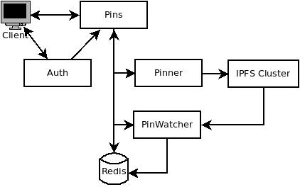

# Axis _(Axis Pinning Service)_
IPFS pinning service written in Go.

Axis is an Open Source [IPFS (Interplanetary File System)](https://ipfs.io/) pinning service and implements the
[IPFS Pinning Service API](https://ipfs.github.io/pinning-services-api-spec/).
It acts as a persistent backup for distributed content. The current
implementation depends on Redis as a centralized database for the service's
"Pins". Currently users are not yet defined, meaning pins are not owned by
anyone but the service.

## Table of Contents
- [Background](#background)
- [Install](#install)
- [Usage](#usage)
- [License](#license)

## Background
This project was created as an open example of an implementation of the IPFS
pinning service API. Prior to the project's development, it was difficult to
find one. Therefore (at the time) it made sense to make one. A pinning service
acts as a persistent IPFS node(s) for managing distributed content. Content
includes files and directories; thus the "File System" part of IPFS.

At a high-level the service looks like the following:



There are 4 main components. They are:
1. Pins  
 The entrypoint into the service that manages the Pins. Allowing Pins to be
 retrieved, created, updated, patched, and removed.
2. Pinner  
 Responsible for adding and removing Pins.
3. Pin Watcher*  
 Watches for Pin status changes in the IPFS cluster. For example, when a file is
 pinned or unpinned.
4. Redis  
 A centralized repository for tracking Pins and their meta-data. The
 [RediSearch](https://oss.redis.com/redisearch) module is required. See
 [redisedge](https://github.com/crossedbot/docker/tree/dev/redisedge) for
 reference.

\* Planned to be refactored to include background saving for persistance
between service downtime.

The HTTP API documentation can be found [here](api/pins/pins.yml). The project
includes a PUT endpoint to replace Pin objects in addition to the
specification's POST action. Authentication is verified via an authentication
token. Where an Auth service is expected to have a path to
`/.well-known/jwks.json` for token validation. For reference, see the `jwk`
package of [simplejwt](https://github.com/crossedbot/simplejwt).

## Install
Installation can be done via the [Makefile](Makefile). By default the `pins`
executable is installed under `/go/bin` but can be changed by setting `GOBIN`.
```
Build and install the pins service under the present working directory
$ (export GOBIN=$(pwd) && cd cmd/pins/ && make -f ../../Makefile build)
```

Furthermore, a [Dockerfile](deployments/docker/pins.Dockerfile) has been
written. To build the Docker image, run:
```
$ docker build -t crossedbot/axis -f deployments/docker/pins.Dockerfile .
```

## Usage
```
Usage of pins:
  -config-file string
        path to configuration file (default "~/.axis/config.toml")
```

A [Bash script](scripts/run.bash) has been written for further
abstraction:
```
run.bash [-h] [-c <configuration>] [-d <database address>]
    [-i <ipfs address>] [-p <port>] -- program to start an Axis service
where:
    -a  set authenticator address; default is 'http://127.0.0.1:8080/.well-known/jwks.json'
    -c  configuration file location; default is '${HOME}/.axis/axis.toml'
    -d  set database address; default is '127.0.0.1:6379'
    -h  show this help text
    -i  set IPFS cluster multi-address; default is '/ip4/127.0.0.1/tcp/9094'
    -p  set listening port of HTTP API; default is 7070"
    exit
```

## License
[MIT](LICENSE) &copy; crossedbot
